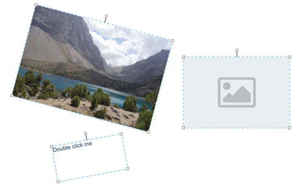

# Description
Vue component which acts as a draggable, resizable and rotateable container for any content.

[](http://drr.minogin.com/)

### Demo

http://drr.minogin.com/

### Features
* All the properties are reactive.
* Correct rotation based on vector geometry. Rotated container resizes correctly.
* Supports fixed aspect ratio which is applied correctly when container is rotated.
* Supports active (e.g. editable) content. For example you can create a draggable and resizable textbox and edit the text inside on double click.
* Supports both outer and inner boundaries, i.e. container will always contain inner boundary and outer boundary will always contain the container. 
* DRR-containers could be nested, e.g. for editing tree-like structures.

### Please note!
          
(x; y) are the coordinates of the **center** of the container, not the left-top corner. It is because the container could be rotated and therefore we don't know which corner would be left-top.

### Inspired by

[Vue-drag-resize component](https://www.npmjs.com/package/vue-drag-resize) 

    

# Installation and usage

Install with npm

```bash
npm i @minogin/vue-drag-resize-rotate
```

Add the following lines to your index.js (main.js):

```javascript
import drr from '@minogin/vue-drag-resize-rotate'

...

Vue.component('drr', drr)
```

Use DRR in your Vue templates:

```javascript
<drr
    :x="item.x"
    :y="item.y"
    :w="item.weight"
    :h="item.height"
    :angle="item.angle"
    :aspectRatio="true"
    @change="itemChange"
>
    
</drr>
```

```javascript
<drr
    :x="textbox.x"
    :y="textbox.y"
    :w="textbox.weight"
    :h="textbox.height"
    :rotateable="false"
    :isActive="textbox.selected"
    :selectable="!textbox.locked"
    :hasActiveContent="true"
    @activated="selectItem(textbox.id)"
    @deactivated="deselectItem(textbox.id)"
    @dragstop="textboxDragStop(textbox, ...arguments)"
    @resizestop="textboxResizeStop(textbox, ...arguments)"
    @rotatestop="textboxRotateStop(textbox, ...arguments)"
    :innerBox="innerBox"
    :outerBox="outerBox"
>
          <TextBox />
</drr>
```

# Documentation

## Properties

#### x, y
Type: `Number`\
Required: `true`

Center of the container.

**Please note!**\
(x; y) are the coordinates of the **center** of the container, not the left-top corner. It is because the container could be rotated and therefore we don't know which corner would be left-top.

#### w, h
Type: `Number`\
Required: `true`

Width and height of the container.

#### angle
Type: `Number`\
Required: `false`\
Default: `0`

Rotation angle in degrees starting from up-axis.

#### selected
Type: `Boolean`\
Required: `false`\
Default: `false`

Whether the container is selected and therefore able to be dragged, resized and rotated.

#### selectable
Type: `Boolean`\
Required: `false`\
Default: `true`

Whether the container could be selected by mouse click or touch.

#### draggable
Type: `Boolean`\
Required: `false`\
Default: `true`

Whether the container could be dragged.

#### resizable
Type: `Boolean`\
Required: `false`\
Default: `true`

Whether the container could be resized.

#### rotatable
Type: `Boolean`\
Required: `false`\
Default: `true`

Whether the container could be rotated.

#### aspectRatio
Type: `Boolean`\
Required: `false`\
Default: `false`

Whether to preserve aspect ratio on resize.

#### hasActiveContent
Type: `Boolean`\
Required: `false`\
Default: `false`

Setting this to `true` means that there is some content in the container that could be activated by double click. For example editable text field, an image which enlarges or some active nested elements.
When content is activated by double click the container gets locked and every child receives 'active' event.
```javascript
// In child component:
mounted() {
  this.$on('active', this.onActive)
},
```

The container itself doesn't roll back to normal state on blur. The children must determine by themselves when the job is finished and send the 'content-inactive' event to the parent DRR like this:
```javascript
// In child component:
this.$parent.$emit('content-inactive')
```
      

#### outerBound
Type: `Object`\
Required: `false`\
Default: `null`

A rectangular object
```javascript
{
  x: ...,
  y: ...,
  w: ...,
  h: ...
}
```
which is the outer limit for DRR dragging and resizing. This boundary currently applies only to not rotated DRR. x and y are the coordinates of the center of the rectangle.

#### innerBound
Type: `Object`\
Required: `false`\
Default: `null`

A rectangular object
```javascript
{
  x: ...,
  y: ...,
  w: ...,
  h: ...
}
```
which is the inner limit for DRR dragging and resizing. It means that this rectangle will always be contained inside the container. 
 This boundary currently applies only to not rotated DRR. x and y are the coordinates of the center of the rectangle.

## Events

#### select
Fires when container is selected (focused).

#### deselect
Fires when container loses focus by clicking outside of the container.

**Please note!** Currently clicking on another DRRs does not deselect current DRR. You must keep proper selection yourself using `selected` property. 

#### dragstart (rect)
Properties:\
`rect`: `Object { x, y, w, h, angle }` - container coordinates on drag start

Fires on drag start.

#### drag (rect)
Properties:\
`rect`: `Object { x, y, w, h, angle }` - current container coordinates

Fires continuously while dragging

**Please note!** This event fires many times per second. Consider handler [debouncing](https://lodash.com/docs/#debounce).  
 
#### dragstop (rect, startRect)
Properties:\
`rect`: `Object { x, y, w, h, angle }` - final container coordinates\
`startRect`: `Object { x, y, w, h, angle }` - initial container coordinates.

Fires when drag finishes.

#### resizestart (rect)
Properties:\
`rect`: `Object { x, y, w, h, angle }` - container coordinates on resize start.

Fires on resize start.

#### resize (rect)
Properties:\
`rect`: `Object { x, y, w, h, angle }` - current container coordinates

Fires continuously while resizing.

**Please note!** This event fires many times per second. Consider handler [debouncing](https://lodash.com/docs/#debounce).  
 
#### resizestop (rect, startRect)
Properties:\
`rect`: `Object { x, y, w, h, angle }` - final container coordinates\
`startRect`: `Object { x, y, w, h, angle }` - initial container coordinates

Fires when resize finishes.

#### rotatestart (rect)
Properties:\
`rect`: `Object { x, y, w, h, angle }` - container coordinates on rotation start.

Fires on rotation start.

#### rotate (rect)
Properties:\
`rect`: `Object { x, y, w, h, angle }` - current container coordinates

Fires continuously while rotating.

**Please note!** This event fires many times per second. Consider handler [debouncing](https://lodash.com/docs/#debounce).  
 
#### rotatestop (rect, startRect)
Properties:\
`rect`: `Object { x, y, w, h, angle }` - final container coordinates\
`startRect`: `Object { x, y, w, h, angle }` - initial container coordinates

Fires when rotation finishes.

#### change (rect)
Properties:\  
`rect`: `Object { x, y, w, h, angle }` - final container coordinates\

Fired when drag, resize or rotate finishes.

#### content-active

Fired when container is double-clicked and `hasActiveContent` property is set to `true`. See `hasActiveContent` property.

#### active

Fired on every child component when container is double-clicked and `hasActiveContent` property is set to `true`. See `hasActiveContent` property.

#### inactive

Fired on every child when container receives 'content-inactive' event and `hasActiveContent` property is set to `true`. Might be useful to inactivate multiple children. See `hasActiveContent` property.  

## Control events

#### content-inactive

When container being in 'active content' state receives this event it returns to normal state. This event must be fired by children when content job is finished. See `hasActiveContent` property.

## Hints

For the content (img, div, etc.) to resize along with the container use
```css
width: 100%;
height: 100%;
```
style on the content element.

For nested text inputs use
```css
position: absolute;
```
 

# Repository

https://github.com/minogin/vue-drag-resize-rotate

# Contacts

Please contact me at [minogin@gmail.com](mailto:minogin@gmail.com) or at GitHub 

# License

[ISC](https://opensource.org/licenses/ISC)
